# DevOps Diploma Project

Дипломный проект по курсу DevOps.

Цель проекта — развернуть инфраструктуру в Yandex Cloud с использованием Terraform, создать self-hosted Kubernetes-кластер с помощью Kubespray, развернуть тестовое приложение и систему мониторинга, а также настроить CI/CD инфраструктуры и приложения.

---

## Репозитории

Проект разделён на два GitHub-репозитория:

### Infrastructure

https://github.com/ccyberpetya/devops-diplom-infastructure

Содержит:

- Terraform-конфигурацию Yandex Cloud;
- конфигурацию Ansible/Kubespray;
- Kubernetes manifests;
- конфигурацию Traefik;
- конфигурацию мониторинга;
- Terraform GitHub Actions workflow.

### Application


https://github.com/ccyberpetya/devops-dip-app

Содержит:

- исходный код тестового приложения;
- Dockerfile;
- GitHub Actions workflow для сборки Docker image;
- CD pipeline для автоматического deployment приложения в Kubernetes.

---

# Используемые технологии

- Yandex Cloud
- Terraform
- Yandex Object Storage
- Yandex Container Registry
- Ansible
- Kubespray
- Kubernetes
- Docker
- Traefik
- Yandex Network Load Balancer
- Prometheus
- Grafana
- Alertmanager
- node_exporter
- GitHub Actions

---


---

# 1. Облачная инфраструктура

Облачная инфраструктура развёрнута в Yandex Cloud и описана с помощью Terraform.

Terraform-конфигурация разделена на две части:

```text
terraform/
├── bootstrap/
└── infrastructure/
```

## Bootstrap

Bootstrap создаёт ресурсы, необходимые для работы основной Terraform-конфигурации:

- Service Account для Terraform;
- IAM-роли;
- Static Access Key;
- Object Storage bucket для Terraform State;
- Service Account для Kubernetes image pull;
- Service Account для GitHub Actions и работы с Yandex Container Registry.

Пример ресурсов bootstrap:

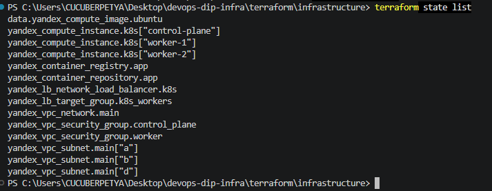

Проверка конфигурации:

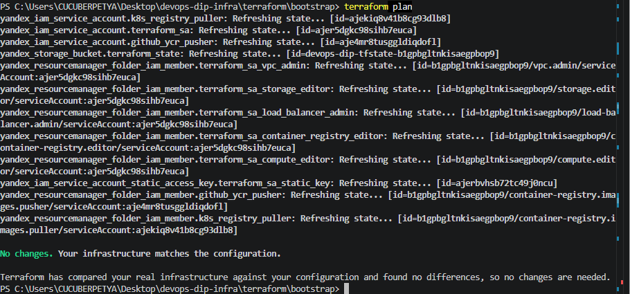

Terraform сообщает:

```text
No changes. Your infrastructure matches the configuration.
```

## Remote Terraform State

Terraform State основной инфраструктуры хранится в Yandex Object Storage.

Bucket:

```text
devops-dip-tfstate-b1gpbgltnkisaegpbop9
```

Внутри bucket хранится:

```text
infrastructure/terraform.tfstate
```

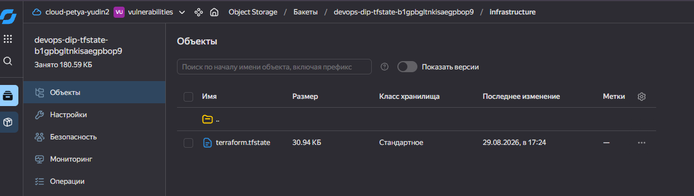


Terraform State и credentials не сохраняются в Git.

---

# 2. Сеть

В Yandex Cloud создана отдельная VPC:

```text
devops-dip-network
```

Используются три подсети в разных зонах доступности:

| Zone | CIDR |
|---|---|
| `ru-central1-a` | `10.10.1.0/24` |
| `ru-central1-b` | `10.10.2.0/24` |
| `ru-central1-d` | `10.10.3.0/24` |

Для Control Plane и Worker Nodes настроены отдельные Security Groups.

---

# 3. Виртуальные машины

Для Kubernetes-кластера Terraform создаёт три виртуальные машины:

| Host | Role | Zone |
|---|---|---|
| `k8s-control-plane` | Control Plane / etcd | `ru-central1-a` |
| `k8s-worker-1` | Worker | `ru-central1-b` |
| `k8s-worker-2` | Worker | `ru-central1-d` |

Основная конфигурация VM:

```text
Platform: standard-v3
CPU:      2
RAM:      4 GB
Disk:     20 GB
OS:       Ubuntu 24.04
```

Control Plane используется как non-preemptible VM.

Worker Nodes используются как preemptible VM для уменьшения стоимости учебной инфраструктуры.

Состояние виртуальных машин:

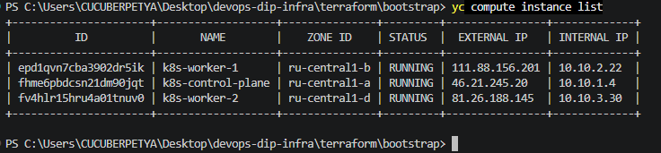

---

# 4. Kubernetes

Для проекта используется self-hosted Kubernetes.

Кластер установлен с помощью:

```text
Ansible + Kubespray
```

Конфигурация Kubespray хранится в репозитории инфраструктуры:

```text
ansible/
└── inventory/
```

Кластер состоит из:

```text
1 x Control Plane
2 x Worker Node
```

Версия Kubernetes:

```text
v1.35.4
```

Для сетевого взаимодействия используется Calico.

Системные Kubernetes-компоненты находятся в состоянии `Running`:

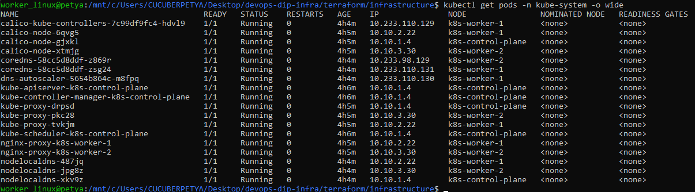


---

# 5. Yandex Container Registry

Container Registry создаётся с помощью Terraform.

В Terraform используется ресурс:

```hcl
resource "yandex_container_registry" "app" {
  ...
}
```

Docker images приложения хранятся в:

```text
cr.yandex/crpg41djdneo0p55bo44/devops-dip-app
```

В registry присутствуют как обычные CI images, так и release image:

```text
latest
sha-*
v1.0.1
1.0.0
```

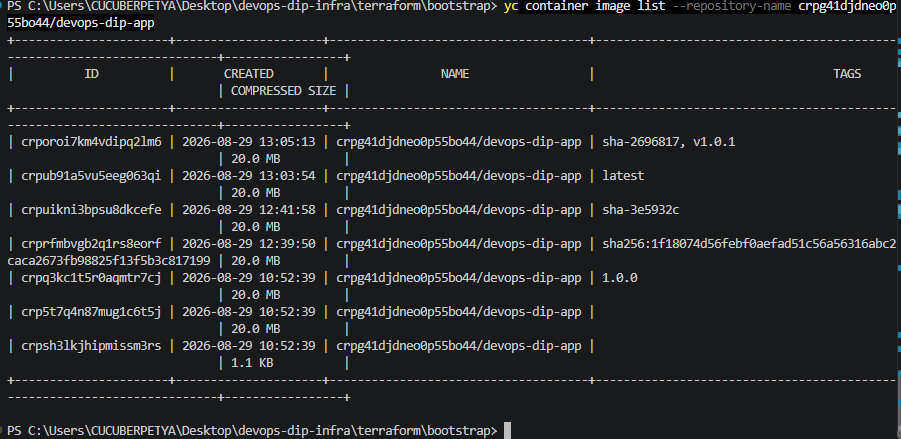

Для Kubernetes используется отдельный Service Account с правами получения images из Container Registry.

---

# 6. Тестовое приложение

Исходный код приложения расположен в отдельном репозитории:

https://github.com/ccyberpetya/devops-dip-app

Приложение представляет собой nginx со статической HTML-страницей.


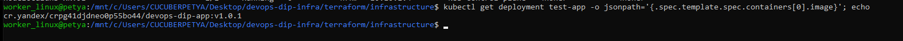

---

# 7. Публикация приложения

Для публикации приложения используется Traefik Ingress Controller.

Traefik установлен в Kubernetes с помощью Helm.

Service Traefik работает как NodePort:

```text
HTTP  : 80  -> 30080
HTTPS : 443 -> 30443
```

Перед Kubernetes расположен Yandex Network Load Balancer.

NLB принимает HTTP-трафик:

```text
80/TCP
```

и передаёт его на Worker Nodes:

```text
30080/TCP
```

## Адрес приложения

http://51.250.39.51/

Приложение доступно через обычный HTTP на 80 порту.

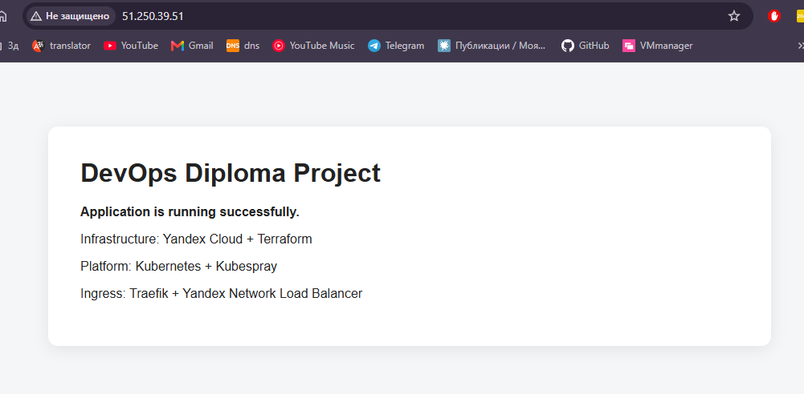

Проверка из терминала:

```bash
curl http://51.250.39.51/
```

---

# 8. Monitoring

Для мониторинга используется Helm chart:

```text
kube-prometheus-stack
```

В Kubernetes развёрнуты:

- Prometheus;
- Grafana;
- Alertmanager;
- Prometheus Operator;
- kube-state-metrics;
- node_exporter.


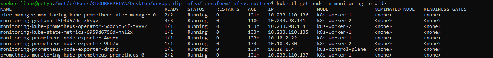

`node_exporter` запущен на всех трёх Kubernetes nodes:

```text
k8s-control-plane
k8s-worker-1
k8s-worker-2
```

---

# 9. Grafana

Grafana опубликована через Traefik и Yandex Network Load Balancer.

## Адрес Grafana

http://51.250.39.51/grafana/

## Данные доступа

```text
Login: admin
Password ***

Пароль намеренно не публикуется в открытом GitHub-репозитории.

В Grafana автоматически установлены dashboards из `kube-prometheus-stack`, включая:

- Alertmanager Overview;
- CoreDNS;
- etcd;
- Kubernetes / API server;
- Kubernetes / Compute Resources / Cluster;
- Kubernetes / Compute Resources / Namespace;
- Kubernetes / Compute Resources / Node;
- Kubernetes / Compute Resources / Pod;
- Kubernetes / Networking;
- Kubernetes / Scheduler;
- Node Exporter / Nodes.

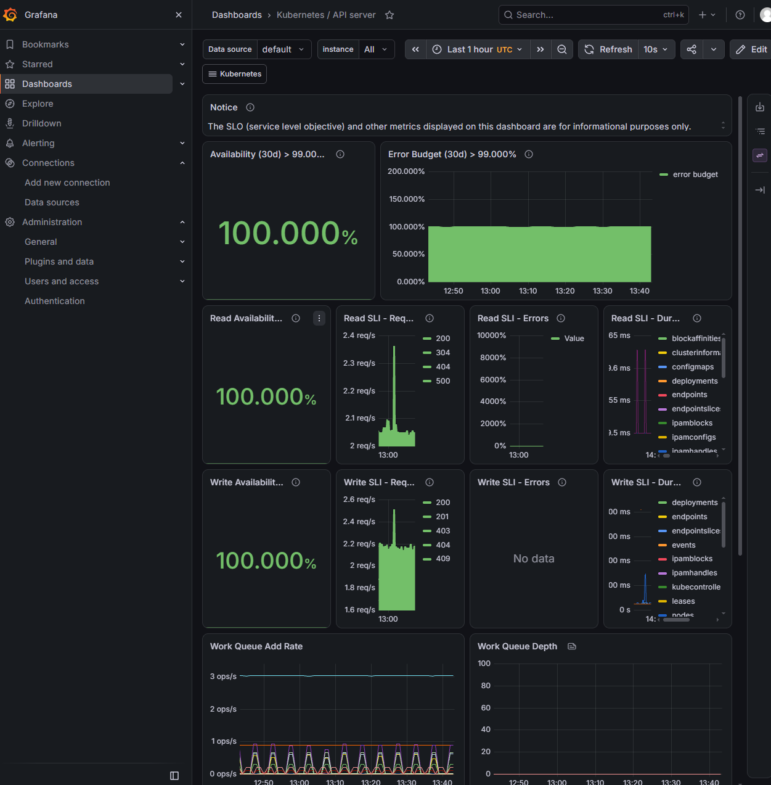

---

# 10. Terraform CI/CD

Для Terraform настроен GitHub Actions workflow:

```text
.github/workflows/terraform.yml
```


Для доступа к Yandex Cloud используется отдельный Service Account.

Credentials хранятся в GitHub Repository Secrets.

Terraform pipeline успешно выполняется:

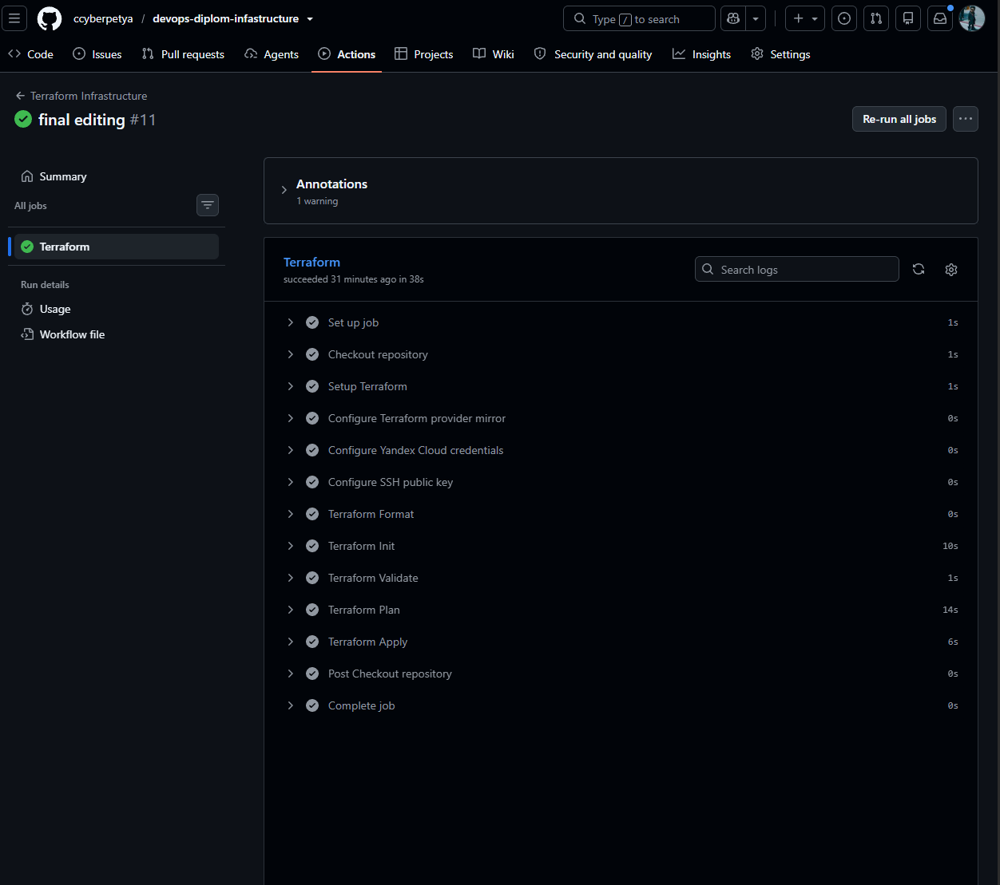

---

# 11. Application CI/CD

Для приложения настроен отдельный GitHub Actions workflow:

```text
.github/workflows/build.yml
```

## CI при commit в main

При каждом Push в ветку:

```text
main
```

выполняется:

```text
Checkout
   |
   v
Login to Yandex Container Registry
   |
   v
Docker Build
   |
   v
Docker Push
```

Создаются Docker tags:

```text
latest
sha-<short-commit-sha>
```

## CD по Git Tag

При создании Git Tag:

```bash
git tag v1.0.1
git push origin v1.0.1
```

workflow выполняет:

```text
Git Tag
   |
   v
GitHub Actions
   |
   v
Docker Build
   |
   v
Yandex Container Registry
   |
   v
Self-hosted GitHub Runner
   |
   v
kubectl set image
   |
   v
Kubernetes Deployment
   |
   v
Rolling Update
```

Для release `v1.0.1` был автоматически создан image:

```text
cr.yandex/crpg41djdneo0p55bo44/devops-dip-app:v1.0.1
```

и выполнен deployment в Kubernetes.

GitHub Actions:

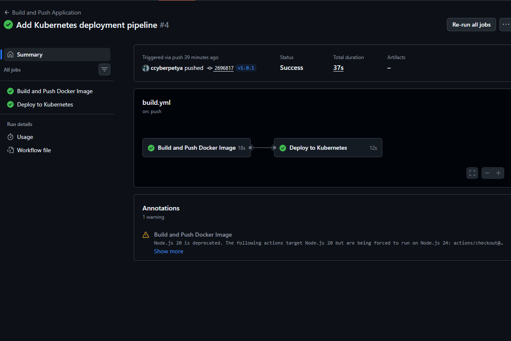

---

# 12. Self-hosted GitHub Actions Runner

GitHub-hosted runner не имеет сетевого доступа к приватному Kubernetes API.

Для deployment используется отдельный self-hosted GitHub Actions Runner.

Runner установлен на:

```text
k8s-worker-1
```

Статус runner:

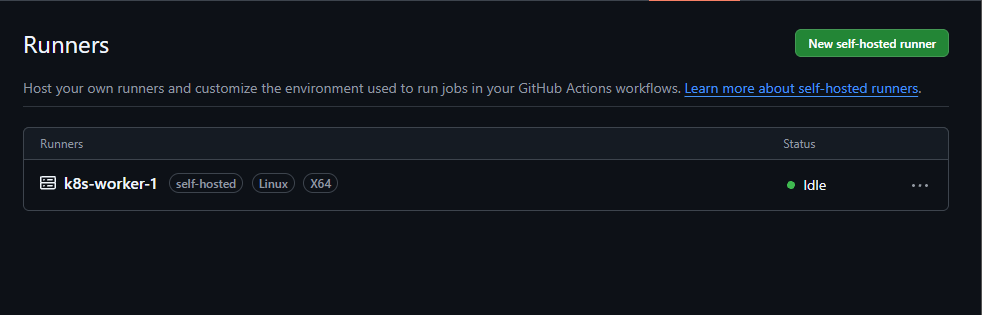

Runner имеет доступ к Kubernetes API внутри VPC и выполняет только deployment job.

---

# 13. Kubernetes RBAC для CI/CD

Для GitHub Actions создан отдельный Kubernetes Service Account:

```text
github-deployer
```

Для него настроен ограниченный RBAC.

Разрешены операции:

```text
get/list/watch deployments
patch/update deployments

get/list/watch replicasets

get/list/watch pods
```

Не разрешены:

```text
delete pods
delete nodes
create deployments
```

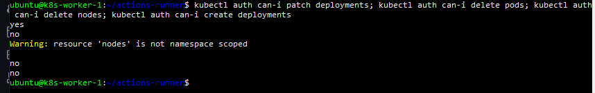

Таким образом GitHub Actions не использует права `cluster-admin` и имеет только минимально необходимые права для deployment приложения.

---


# 14. Безопасность

В Git не сохраняются:

```text
Terraform State
*.tfvars
Service Account JSON keys
Private SSH keys
Kubeconfig
Service Account token values
GitHub Secrets
```

Credentials GitHub Actions хранятся в:

```text
GitHub Repository Secrets
```

Открытые параметры конфигурации хранятся в:

```text
GitHub Repository Variables
```

Для разных задач используются отдельные Yandex Cloud Service Accounts.

Для Kubernetes CI/CD используется отдельный Service Account с ограниченным RBAC.

---
